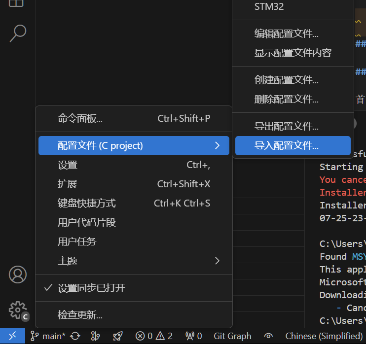
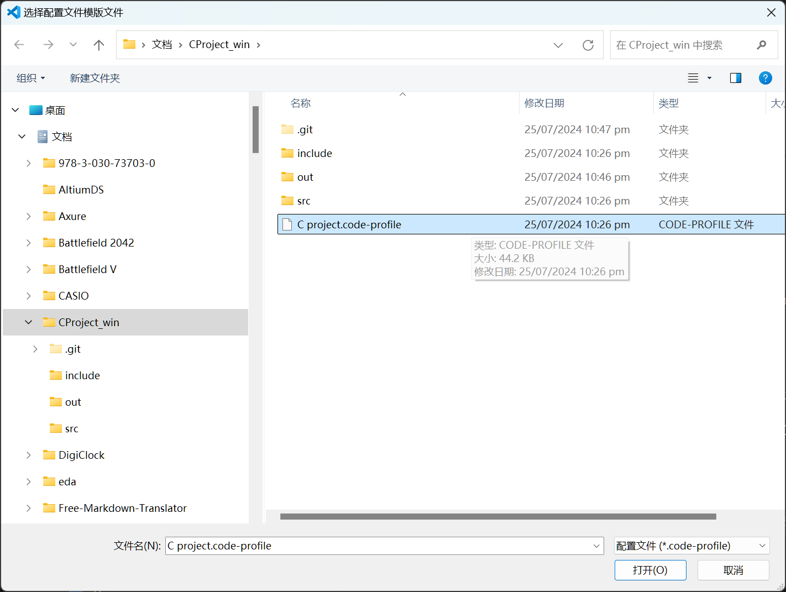
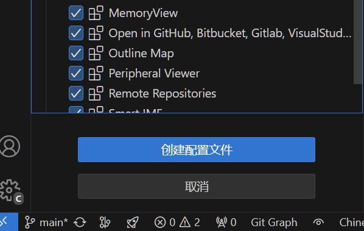
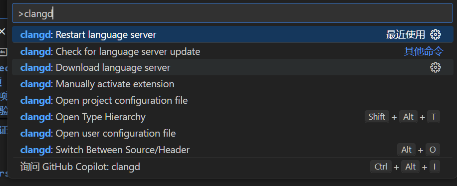

# MyProject

这是一个使用 C 语言开发的大富翁示例工程，适用于 Windows 环境,采用 CMake 生成构建工程,conan管理依赖项,VSCode编辑器开发,ninja构建工程.

## 目录结构

```tree
CPROJECT_WIN
├───.cache
│   └───clangd
│       └───index
├───.vscode
├───build
│   └───Release
│       ├───CMakeFiles
│       │   ├───3.29.2
│       │   │   ├───CompilerIdC
│       │   │   │   └───tmp
│       │   │   └───CompilerIdCXX
│       │   │       └───tmp
│       │   ├───MyProject.dir
│       │   │   └───src
│       │   └───pkgRedirects
│       └───generators
├───include
├───out
└───src
```

## 依赖项

- [Conan](https://conan.io/)
官网下载
- [CMake](https://cmake.org/)
官网下载
- [Ninja](https://ninja-build.org/)

```powershell
pip install ninja
```

- 编译器:mingw64 gcc

### 依赖项安装

要在 Windows 上使用 `winget` 安装 `conan` 和 `cmake` 以及 `mingw64 gcc`，请按照以下步骤操作：

#### 1. 安装 `winget` (win11一般自带)

`winget` 是 Windows 包管理器。**最新版本的 Windows 10 和 Windows 11 默认包含 `winget`**。如果没有，可以按照以下步骤安装：

1. 打开 [Windows Package Manager](https://github.com/microsoft/winget-cli/releases) 的 GitHub 页面。
2. 下载最新的 `Microsoft.DesktopAppInstaller_8wekyb3d8bbwe.appxbundle` 文件并安装。

#### 2. 使用 `winget` 安装 `conan` 和 `cmake`

打开命令提示符或 PowerShell，以管理员身份运行以下命令：

```powershell
winget install JFrog.Conan
winget install Kitware.CMake
```

#### 3. 安装 `mingw64 gcc`

1. 使用 `winget` 安装 `mingw64`：

    ```powershell
    winget install -e --id MSYS2.MSYS2
    ```

2. 安装 `mingw64` 后，打开 `MSYS2` 终端并运行以下命令以更新包管理器：

    ```sh
    pacman -Syu
    ```

3. 重新启动 `MSYS2` 终端，运行以下命令以安装 `mingw-w64` 编译器和其他必要工具：

    ```sh
    pacman -Su
    pacman -S mingw-w64-x86_64-toolchain
    ```

#### 4. 配置环境变量

确保将 `mingw64` 的 `bin` 目录添加到你的系统 `PATH` 环境变量中。步骤如下：

1. 右键点击“此电脑”或“计算机”，选择“属性”。
2. 点击“高级系统设置”。
3. 在“系统属性”窗口中，点击“环境变量”。
4. 在“系统变量”部分，找到并选中“Path”，然后点击“编辑”。
5. 点击“新建”，然后添加 `C:\msys64\mingw64\bin`（假设你的 `MSYS2` 安装在 `C:\msys64` 目录下）。

#### 5. 验证安装

在命令提示符或 PowerShell 中运行以下命令以验证安装是否成功：

##### 验证 `conan` 安装

```powershell
conan --version
```

##### 验证 `cmake` 安装

```powershell
cmake --version
```

##### 验证 `mingw64 gcc` 安装

```sh
gcc --version
```

通过上述步骤，你应该能够成功安装和配置 `conan`、`cmake` 和 `mingw64 gcc`，并能够在 Windows 上使用它们进行开发。

### vscode开发教程

#### 1. 导入配置文件

首先，将C project.code-profile导入到VSCode中，这样VSCode就会自动加载项目配置。







#### 2. 安装插件依赖项



按下ctrl+shift+p，输入clangd，选择clangd:Download Language Server，下载完成后重启vscode。

#### 3. 编译项目

打开终端，输入以下命令：(注意,在CMakeLists.txt目录下)

```powershell
.\build_win.bat
```

看到如下输出，说明编译成功：

```powershell
============Running MyProject.exe=============
next:-1 0 1 2 3 4 5 6 7 
pos = -1
Press any key to continue . . .
```

## 构建和运行 - 可以只看2和3步

### 1. 安装依赖项

首先，确保您已经安装了 Conan、CMake 和 Ninja。然后运行以下命令来安装项目依赖项：

```sh
conan install . --build=missing --profile=conan_profile_x64
```

### 2. 配置和构建项目

运行 build_win.bat 脚本来配置和构建项目：

```powershell
.\build_win.bat
```

### 3. 运行可执行文件

构建完成后，您可以在 out 目录下找到生成的可执行文件 MyProject.exe。运行它：

```powershell
cd out
.\MyProject.exe
```

## 项目文件说明

- main.c：主程序文件，包含 KMP 算法的实现。
- include/kmp.h：KMP 算法的头文件。
- src/kmp.c：KMP 算法的实现文件。
- .clangd: LSP 服务器配置文件。
- .vscode: Visual Studio Code 配置文件。
- CMakeLists.txt：CMake 构建脚本。
- conanfile.txt：Conan 依赖项配置文件。
- build_win.bat：构建项目的脚本。
- conan_profile_x64：Conan 依赖项配置文件。
- README.md：项目说明文件。
- C project.code-workspace：VSCode 工作区配置文件。
- doc/：文档目录。内含燃尽图与状态墙

## 参考测试用例

```tree
├── test1/
│   │   ├── input.txt
│   │   ├── expected_output.json
│   │   ├── output.txt
│   │   ├── error.txt
│   │   └── user.json
├── test2/
```
